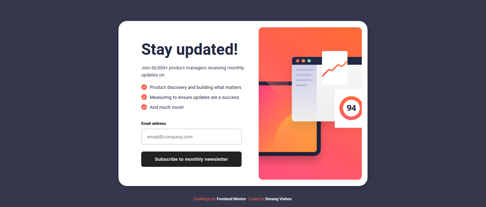
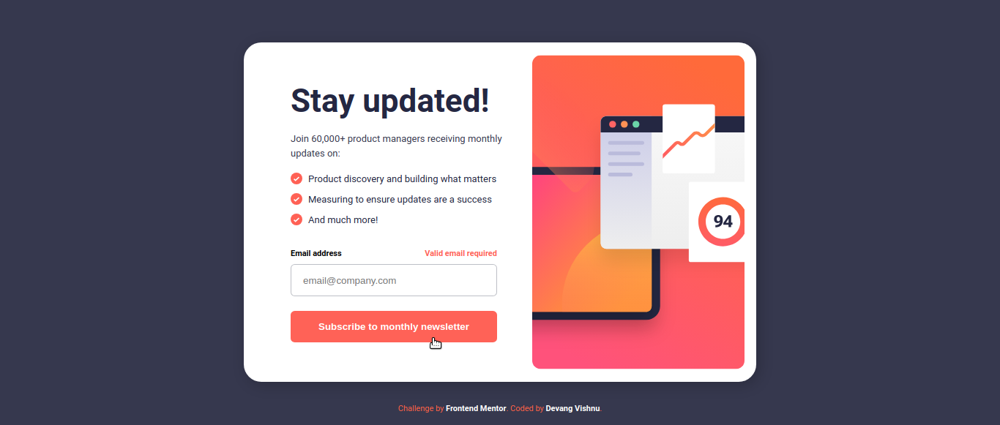
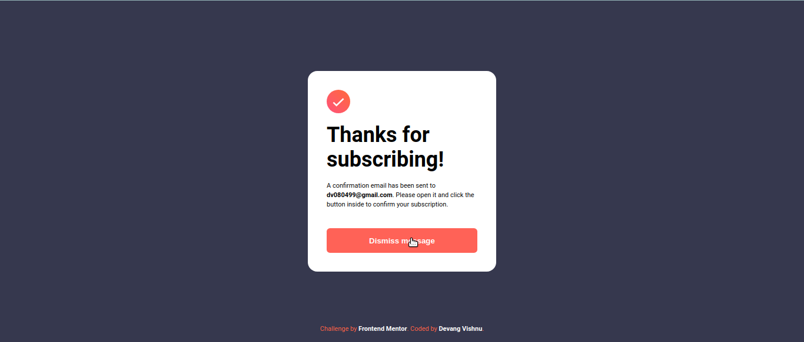

# Project-01(P01): Newsletter sign-up form with success message

## Table of Contents

- [Overview](#overview)
  - [Screenshot](#screenshot)
  - [Links](#links)
- [My process](#my-process)
  - [Tools used](#tools-used)
  - [Challenges faced](#challenges-faced)
  - [Lessons learned](#lessons-learned)
- [Author](#author)

## Overview

This is my first practice project from Frontend Mentor in this "junior" series.

### Screenshot

Down below I've added the screenshot of my project final results.

Desktop View - Contains screenshots for normal view and active view.

## My process

### Tools used

Following are the tools/languages that were used to build this project.

- Semantic HTML5
- CSS3
- Custom css variables
- Media queries for responsiveness
- Flexbox for layout
- JS
- DOM manipulation

### Challenges faced

I faced one major challenge while creating this project.

- I was not able to make this design responsive. Not because I couldn't find a way to make the layout responsive, rather I was not able to use responsive images correctly. I tried using scrset and sizes attributes in my HTML, but I am not able to identify the reason of their malfunctioning.

### Lessons learned

This was a good project. It demanded decent DOM manipulation which led me to practice my JS knowledge. The biggest lesson for me was to figure out how I could use responsive images, which I was not able to.
I tried and tested many approaches but they all seem to not be working.

It took decent amount of CSS to style, though felt fairly easy.

## Author

- My GitHub - [Devang Vishnu](https://github.com/thedevangvishnu)
- Frontend Mentor - [@thedevangvishnu](https://www.frontendmentor.io/profile/thedevangvishnu)
