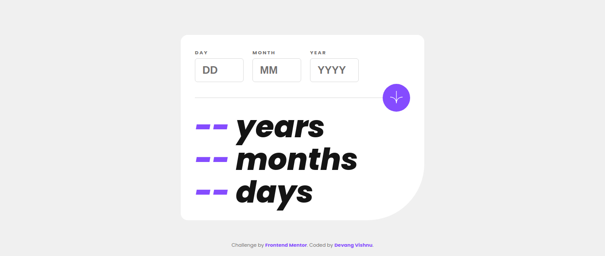
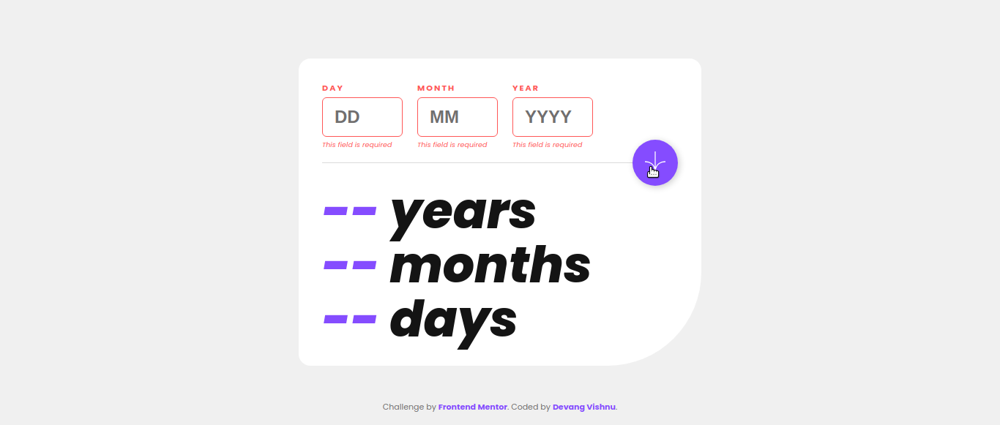
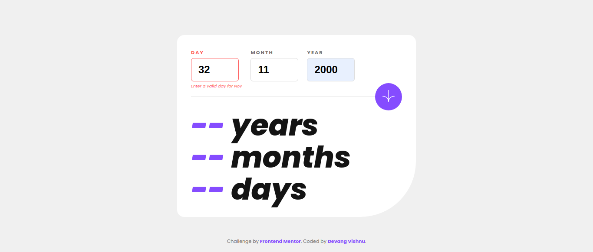
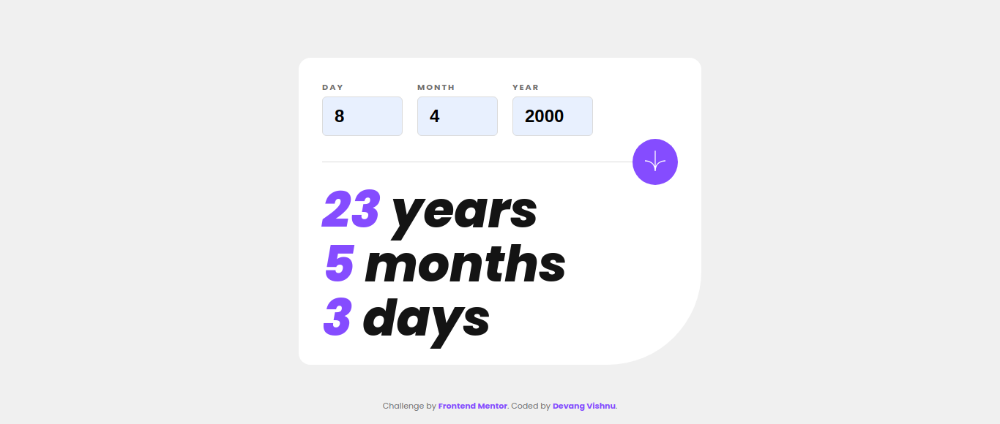
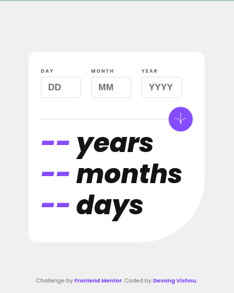
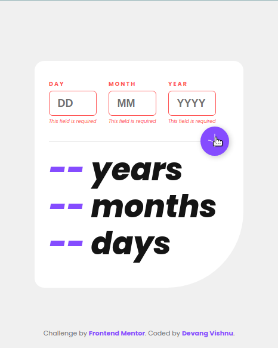
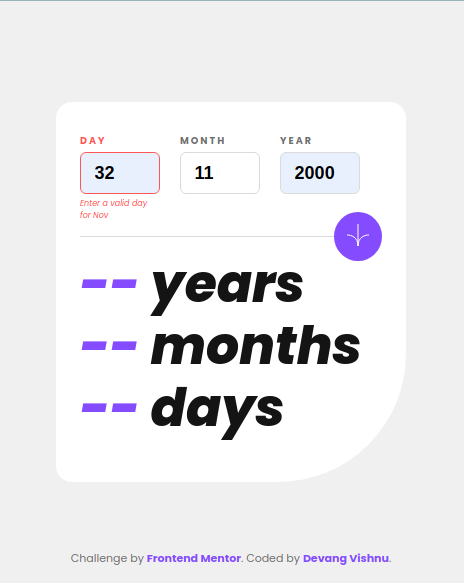
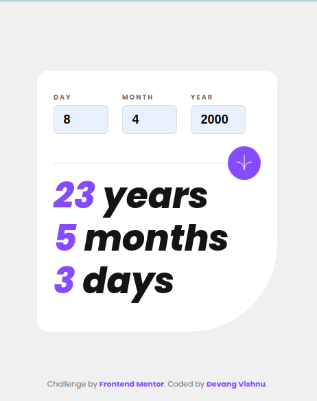

# Project-02(P02): Age calculator app

## Table of Contents

- [Overview](#overview)
  - [Screenshot](#screenshot)
  - [Links](#links)
- [My process](#my-process)
  - [Tools used](#tools-used)
  - [Challenges faced](#challenges-faced)
  - [Lessons learned](#lessons-learned)
- [Author](#author)

## Overview

This is my second practice project from Frontend Mentor in this "junior" series.

### Screenshot

Down below I've added the screenshot of my project final results.

Desktop View - Contains screenshots for empty view, error views and normal view.

Mobile View - Contains screenshots for empty view, error view and normal view.

## My process

### Tools used

Following are the tools/languages that were used to build this project.

- Semantic HTML5
- CSS3
- Custom css variables
- Media queries for responsiveness
- Flexbox for layout
- JS
- DOM manipulation

### Challenges faced

Making this age calculator was not easy for me. I struggled to write the logic for this app. Following were the major challenges:

- Writing logic for all edge cases, such as when the user birthday is yet to arrive this error or when the bday month has arrived but not the date. Similarly, there were many such cases for which I had to think thoroughly.
- Putting validation checks on all of these cases to pop errors also demanded a lot of thinking, time and effort.

### Lessons learned

This has been by far one of the most challenging projects I have made. Age calculators seem simple in terms of what they do, but they are not easy. Major lessons are as follows:

- Ability to think and write validation checks for edge cases.
- Increased confidence with using Date() obj.

It took decent amount of CSS to style, though felt fairly easy.

## Author

- My GitHub - [Devang Vishnu](https://github.com/thedevangvishnu)
- Frontend Mentor - [@thedevangvishnu](https://www.frontendmentor.io/profile/thedevangvishnu)
