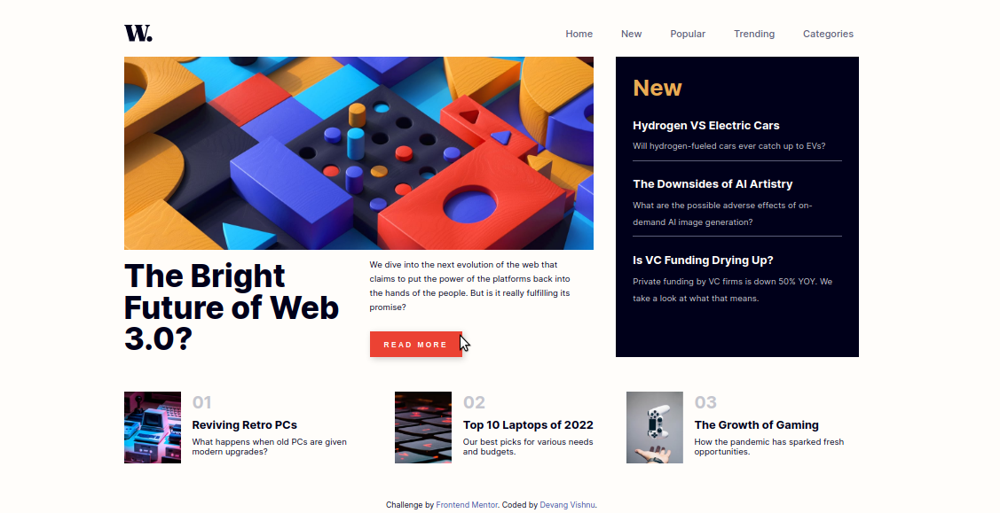
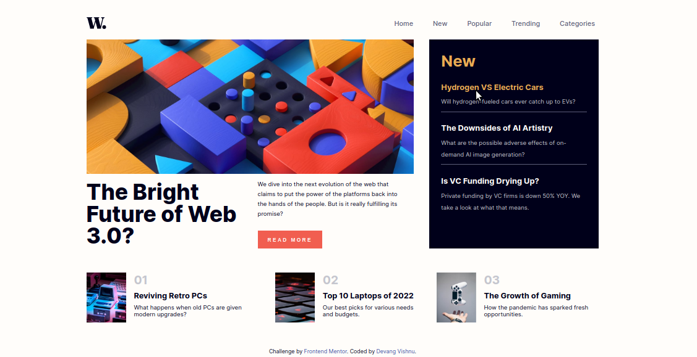
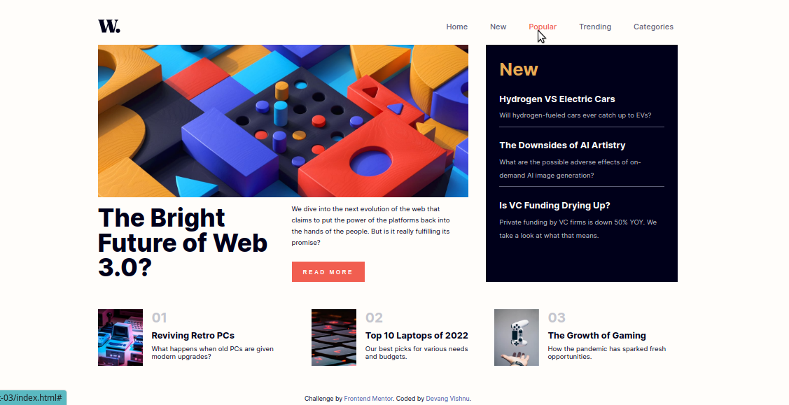
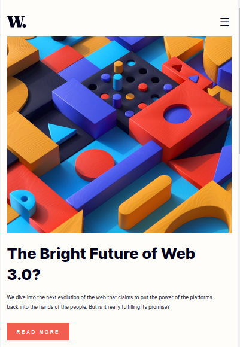
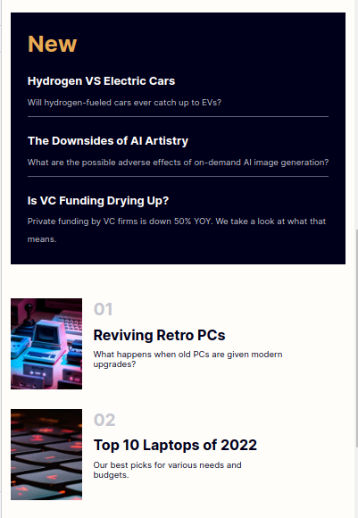
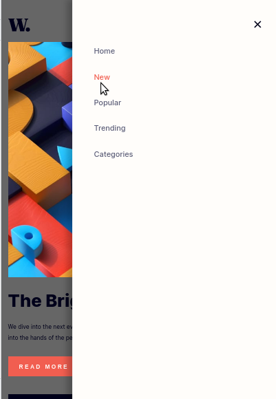

# Project-03(P03): News homepage

## Table of Contents

- [Overview](#overview)
- [Screenshot](#screenshot)
- [My process](#my-process)
  - [Tools used](#tools-used)
  - [Challenges faced](#challenges-faced)
  - [Lessons learned](#lessons-learned)
- [Author](#author)

## Overview

This is my third practice project from Frontend Mentor in this "junior" series. In this project, the task is to create a News Homepage that would demand CSS Grid/Flexbox skills. Also the navigation bar needs to be different for desktop and mobile views.

## Screenshot

Down below I've added the screenshot of my project final results.

Desktop View - Contains screenshots for normal and active view.

Mobile View - Contains screenshots for normal and active view.

## My process

### Tools used

Following are the tools/languages that were used to build this project.

- Semantic HTML5
- CSS3
- Custom css variables
- Media queries for responsiveness
- Flexbox for layout
- JS
- DOM manipulation

### Challenges faced

Making this project was fairly easy. I faced one major challenge:

- For the mobile view, the navigation bar is in the form of a side nav coming in from the right side of the screen as soon as the user clicks the hamburger icon. In addition to that, the body must have a "dark overlay" when the side nav is active. I was not able to apply the overlay correctly. My overlay is being applied to the body but it doesn't overlay the image. The image is still above the overlay. I tried playing with the z-index properties but still wasn't able to achieve the desired look.

### Lessons learned

This project was more like a practice to what I already know and can make using HTML, CSS and JS.
It took decent amount of CSS to style, though felt fairly easy.

## Author

- My GitHub - [Devang Vishnu](https://github.com/thedevangvishnu)
- Frontend Mentor - [@thedevangvishnu](https://www.frontendmentor.io/profile/thedevangvishnu)
